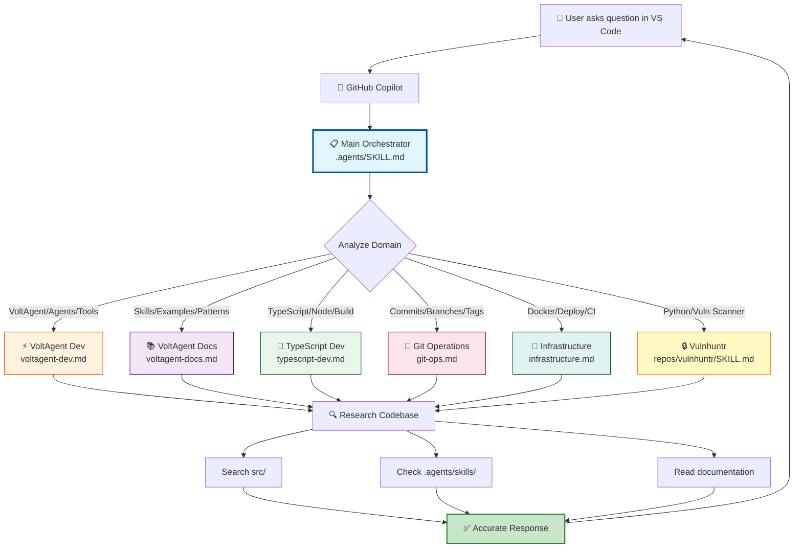
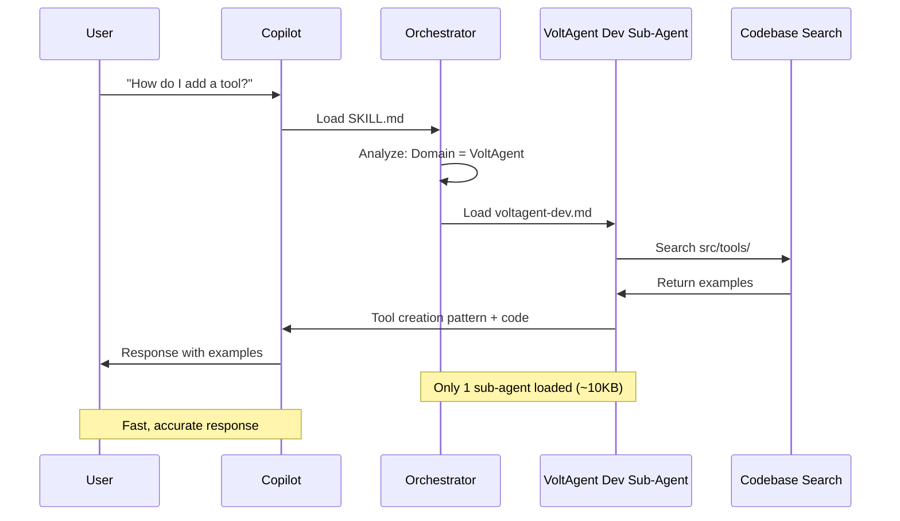
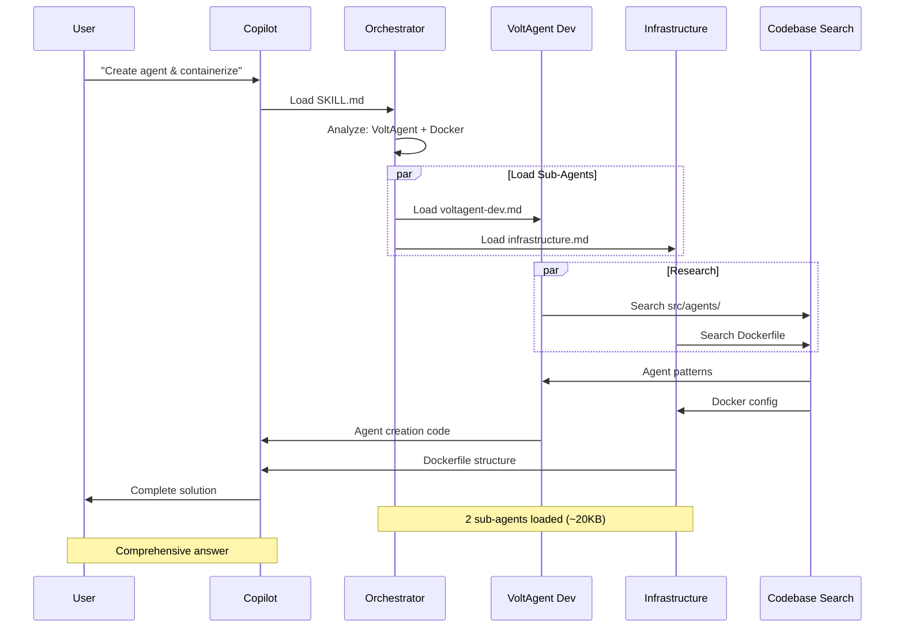
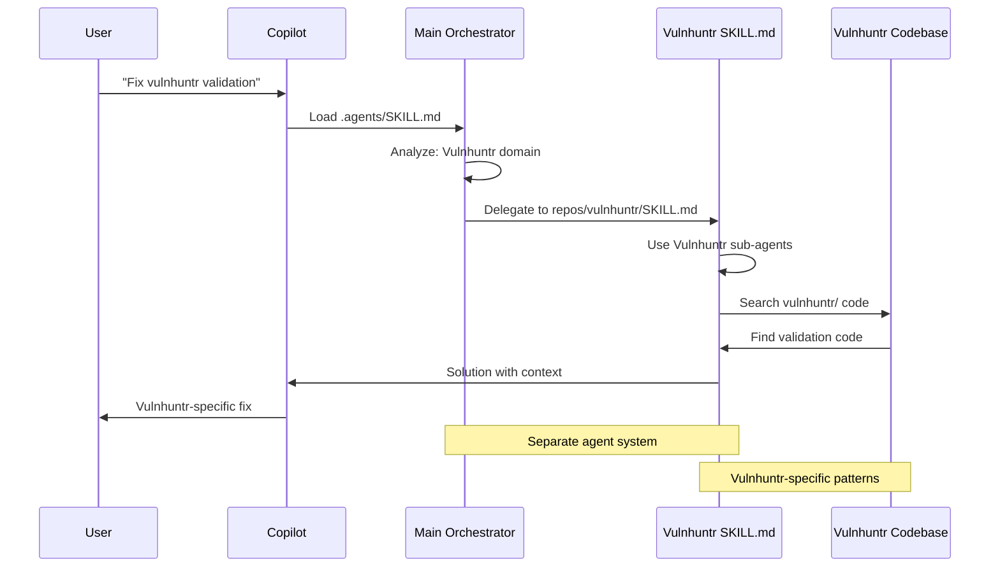
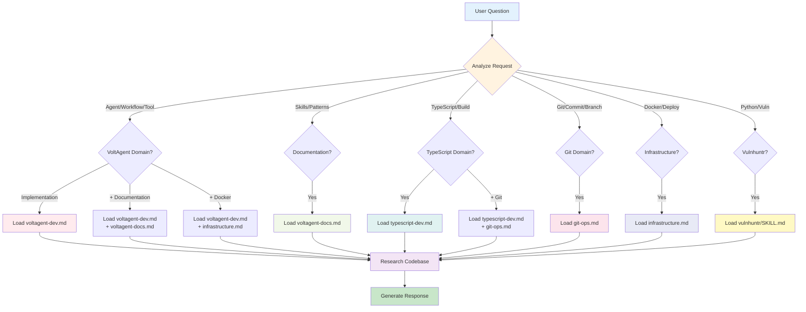
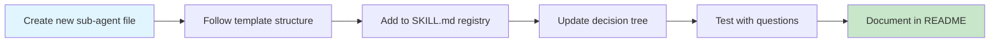

# Agent Orchestration System Architecture

**Version**: 1.0.0  
**Created**: February 6, 2026

---

## System Diagram



---

## Information Flow

### Example 1: Simple Question

**Question**: *"How do I add a tool to my agent?"*



### Example 2: Multi-Domain Question

**Question**: *"Create an agent and containerize it with Docker"*



### Example 3: Vulnhuntr Question

**Question**: *"Fix the Python vulnerability scanner's validation"*



---

## Decision Tree



---

## System Components

### Layer 1: Entry Point

```
┌─────────────────────────────────┐
│   GitHub Copilot (VS Code)      │
│   - Loads via settings.json     │
│   - Always includes SKILL.md    │
└─────────────────────────────────┘
```

### Layer 2: Orchestration

```
┌─────────────────────────────────┐
│   Main Orchestrator             │
│   .agents/SKILL.md (~15KB)      │
│   - Analyzes user question      │
│   - Identifies domain(s)        │
│   - Selects 1-3 sub-agents      │
│   - Never loads all agents      │
└─────────────────────────────────┘
```

### Layer 3: Specialized Sub-Agents

```
┌──────────────┐ ┌──────────────┐ ┌──────────────┐
│  VoltAgent   │ │  VoltAgent   │ │  TypeScript  │
│     Dev      │ │     Docs     │ │     Dev      │
│   (~12KB)    │ │   (~10KB)    │ │   (~12KB)    │
└──────────────┘ └──────────────┘ └──────────────┘

┌──────────────┐ ┌──────────────┐ ┌──────────────┐
│     Git      │ │Infrastructure│ │  Vulnhuntr   │
│   Operations │ │   (~10KB)    │ │  (Separate)  │
│    (~8KB)    │ │              │ │              │
└──────────────┘ └──────────────┘ └──────────────┘
```

### Layer 4: Research & Verification

```
┌─────────────────────────────────────────────────┐
│   Code Search & Verification                    │
│   - semantic_search() - Find patterns           │
│   - grep_search() - Find specific text          │
│   - read_file() - Read implementation           │
│   - file_search() - Find files                  │
└─────────────────────────────────────────────────┘
```

### Layer 5: Knowledge Base

```
┌──────────────┐ ┌──────────────┐ ┌──────────────┐
│  src/        │ │ .agents/     │ │ node_modules/│
│  Codebase    │ │ skills/      │ │ @voltagent/  │
│              │ │ VoltAgent    │ │ Package docs │
└──────────────┘ └──────────────┘ └──────────────┘
```

---

## Context Size Comparison

### Traditional Single-Agent Approach

```
User Question
    ↓
┌─────────────────────────────────────┐
│  Single Large Agent (~50KB+)        │
│  • All VoltAgent knowledge          │
│  • All TypeScript knowledge         │
│  • All Git knowledge                │
│  • All Docker knowledge             │
│  • All documentation                │
│  ❌ Context flooding                │
│  ❌ Slower processing               │
│  ❌ Higher cost                     │
└─────────────────────────────────────┘
    ↓
Response (slower, may be confused)
```

### Orchestrated Multi-Agent Approach

```
User Question
    ↓
┌─────────────────────────────────────┐
│  Main Orchestrator (~15KB)          │
│  • Analyzes question                │
│  • Identifies domain                │
│  ✅ Smart routing                   │
└─────────────────────────────────────┘
    ↓
┌─────────────────────────────────────┐
│  1-3 Relevant Sub-Agents (~10-25KB) │
│  • Only necessary knowledge         │
│  • Domain-specific expertise        │
│  ✅ Focused context                 │
│  ✅ Faster processing               │
│  ✅ Lower cost                      │
└─────────────────────────────────────┘
    ↓
Response (faster, more accurate)
```

### Savings

| Metric | Traditional | Orchestrated | Improvement |
|--------|------------|--------------|-------------|
| **Avg Context** | 50KB+ | 15-30KB | 60-70% reduction |
| **Simple Q** | 50KB | 15-20KB | 60-70% reduction |
| **Complex Q** | 50KB+ | 25-35KB | 30-50% reduction |
| **Processing** | Slower | Faster | Variable |
| **Accuracy** | Mixed | Higher | Better focus |

---

## Configuration Architecture

### VS Code Integration

```
.vscode/settings.json
    ↓
{
  "github.copilot.advanced": {
    "contextFiles": [
      ".agents/SKILL.md"  ← Always loaded
    ]
  }
}
    ↓
GitHub Copilot includes orchestrator with every request
    ↓
Orchestrator decides which sub-agents to load
```

### File Structure

```
vulnhuntr-volt/
├── .agents/                    ← Agent system root
│   ├── SKILL.md               ← Main orchestrator (auto-loaded)
│   ├── README.md              ← Full documentation
│   ├── QUICKSTART.md          ← Quick start guide
│   ├── ARCHITECTURE.md        ← This file
│   ├── sub-agents/            ← Specialized agents
│   │   ├── voltagent-dev.md
│   │   ├── voltagent-docs.md
│   │   ├── typescript-dev.md
│   │   ├── git-ops.md
│   │   └── infrastructure.md
│   └── skills/                ← Official VoltAgent skills
│       ├── voltagent-best-practices/
│       ├── voltagent-docs-bundle/
│       └── create-voltagent/
├── .vscode/
│   ├── settings.json          ← Copilot configuration
│   └── mcp.json               ← MCP servers
├── src/                       ← VoltAgent application
├── repos/
│   └── vulnhuntr/            ← Separate agent system
│       └── SKILL.md          ← Vulnhuntr orchestrator
└── [other project files]
```

---

## Performance Characteristics

### Latency

```
┌─────────────────────────────────────────────────────┐
│  Traditional: Copilot processing 50KB+ context      │
│  ████████████████████████████ ~2-4s                 │
└─────────────────────────────────────────────────────┘

┌─────────────────────────────────────────────────────┐
│  Orchestrated: Process 15KB orchestrator            │
│  ██████████ ~0.5-1s                                 │
│  Then load 10-20KB sub-agent                        │
│  ████████████████ ~1-2s                             │
│  Total: ██████████████████████ ~1.5-3s              │
└─────────────────────────────────────────────────────┘
```

### Token Usage (Estimated)

```
Traditional Approach:
- Context: ~50KB = ~12,500 tokens
- Response: ~500 tokens
- Total: ~13,000 tokens per request

Orchestrated Approach:
- Orchestrator: ~15KB = ~3,750 tokens
- Sub-agent: ~10KB = ~2,500 tokens
- Response: ~500 tokens
- Total: ~6,750 tokens per request

Savings: ~48% fewer tokens
```

---

## Scalability

### Adding New Sub-Agents



### System Limits

- **Sub-Agents**: Recommended 5-10 max
- **Context Per Request**: Target 15-30KB total
- **Agents Loaded**: 1-3 per request max
- **File Size**: Keep sub-agents under 15KB each

---

## Maintenance Architecture

### Update Frequency

```
Main Orchestrator (SKILL.md)
├── Weekly: Review delegation logic
├── Monthly: Update sub-agent registry
└── As needed: Add new routing rules

Sub-Agents
├── Weekly: Update with new patterns
├── Sprint: Sync with codebase changes
└── As needed: Fix outdated information

Skills (Official)
├── Monthly: Run `npx skills add VoltAgent/skills`
└── Version updates: Check for new skills
```

---

## Future Enhancements

### Planned Features

1. **Dynamic Agent Loading**: Load agents based on file context
2. **Agent Metrics**: Track which agents are most used
3. **Context Caching**: Cache frequently-used sub-agents
4. **User Preferences**: Let users prefer certain agents
5. **Agent Versioning**: Track sub-agent versions separately

---

**This architecture ensures fast, accurate, context-efficient responses by intelligently routing questions to specialized experts rather than loading everything at once.**
