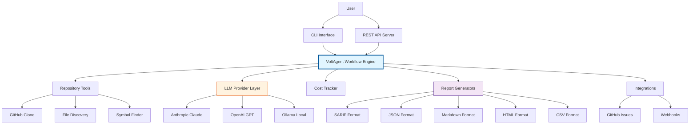
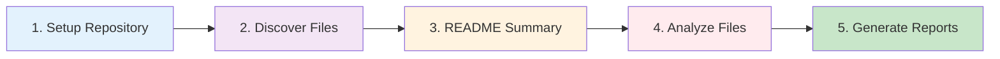
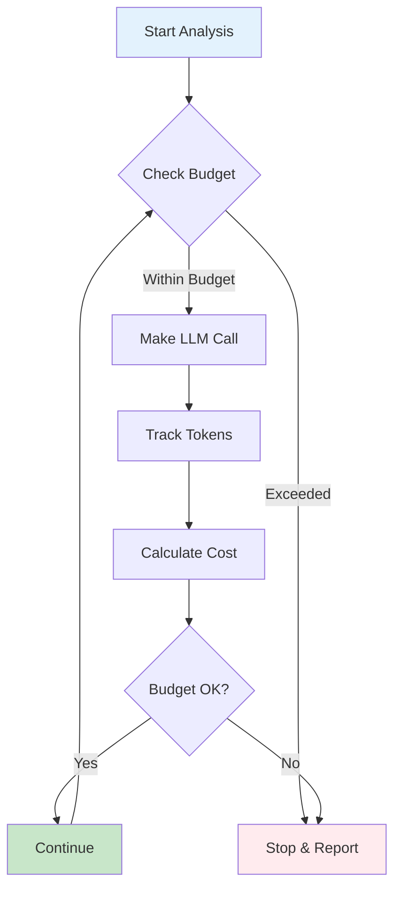
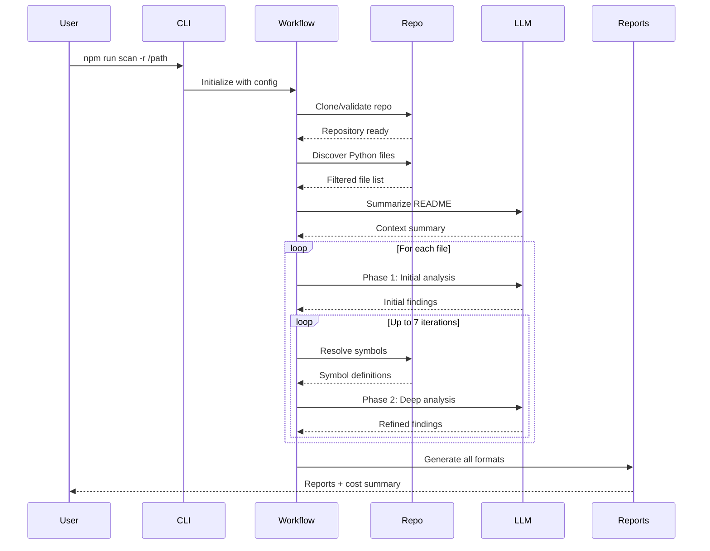

# VulnHuntr-Volt Architecture

## System Overview

VulnHuntr-Volt is an AI-powered vulnerability scanner built on the VoltAgent framework. It performs static analysis of Python codebases to detect security vulnerabilities using large language models (LLMs).

## Architecture Diagram



## Core Components

### 1. Entry Points

#### CLI Interface

- Command-line tool for direct repository scanning
- Supports local paths and GitHub URLs
- Configuration via command-line arguments
- Script: `npm run scan`

#### REST API Server

- HTTP server for workflow execution
- Endpoints for execute and stream modes
- JSON-based input/output
- Runs on port 3141 by default

### 2. Workflow Engine

The main analysis workflow consists of 5 steps:



**Step 1: Setup Repository**

- Clone GitHub repos or validate local paths
- Apply configuration from `.vulnhuntr.yaml` or environment variables

- Initialize cost tracking and checkpoints

**Step 2: Discover Files**

- Scan for Python files (`.py` extension)
- Filter using 120+ network-related regex patterns

- Identify Flask, FastAPI, Django, aiohttp, Starlette, etc.
- Support for targeted analysis of specific files/directories

**Step 3: README Summarization**

- LLM analyzes repository README for security context
- Provides high-level understanding of application purpose
- Identifies potential attack surfaces

**Step 4: Analyze Files**

- **Phase 1 (Initial Analysis)**: Analyze all 7 vulnerability types simultaneously per file
- **Phase 2 (Deep Analysis)**: Iterative analysis with symbol resolution

  - Up to 7 iterations by default
  - Symbol finder resolves function definitions and imports
  - Confidence scoring (0-10 scale)
  - Budget enforcement at each step

**Step 5: Generate Reports**

- Multiple output formats generated simultaneously
- SARIF for GitHub Security integration
- JSON for machine processing

- Markdown and HTML for human review
- CSV for spreadsheet analysis
- Cost report with token usage breakdown

### 3. LLM Provider Layer

**Architecture:**

```typescript
interface LLMProvider {
  generate(prompt: string, options: GenerateOptions): Promise<Response>
  estimateCost(prompt: string): Cost
}

```

**Supported Providers:**

- **Anthropic Claude** (Recommended): claude-sonnet-4, claude-3-7-sonnet-20250219
- **OpenAI GPT**: gpt-4o, gpt-4-turbo, gpt-3.5-turbo
- **Ollama Local**: llama3.1:70b, codellama:34b (no API key required)

**Features:**

- Provider-agnostic interface
- Automatic JSON response fixing
- Claude prefill trick for structured output
- Token counting and cost estimation
- Timeout and retry handling

### 4. Cost Tracking System

**Real-time Budget Enforcement:**



**Cost Tracking Levels:**

- Per-call cost tracking
- Per-file cost accumulation
- Per-iteration budget limits
- Total scan budget enforcement

- Escalating cost detection (warns if costs spike)

### 5. Checkpoint and Resume System

**State Management:**

- Automatic checkpoint creation on SIGINT (Ctrl+C)
- Saves analysis progress to `.vulnhuntr-checkpoint.json`
- Resume capability for interrupted scans
- Preserves findings, file state, and cost data

**Checkpoint Data:**

```json
{
  "timestamp": "2026-02-10T...",
  "repo_path": "/path/to/repo",
  "files_analyzed": ["file1.py", "file2.py"],
  "findings": [...],
  "cost_data": {...},
  "next_file_index": 3
}
```

### 6. Report Generators

**Multi-Format Output:**

| Format | Purpose | Use Case |
|--------|---------|----------|
| **SARIF** | GitHub Security Tab | CI/CD integration |
| **JSON** | Machine processing | Automation, APIs |
| **Markdown** | Human-readable | Documentation |
| **HTML** | Interactive web view | Stakeholder review |
| **CSV** | Spreadsheet analysis | Tracking, metrics |
| **Cost Report** | Budget tracking | Financial planning |

**Report Content:**

- Vulnerability findings with confidence scores
- CWE mappings and severity levels

- Code snippets and line numbers
- Fix suggestions and references
- Cost breakdown by file and iteration

### 7. Tool System

VoltAgent tools provide modular functionality:

#### Repository Tools (`src/tools/repo.ts`)

- **discoverFiles**: Find Python files with network patterns
- **readFile**: Read file contents

- **analyzeDirectory**: Recursive directory scanning

#### GitHub Tools (`src/tools/github.ts`)

- **cloneRepository**: Clone GitHub repos via URL
- **parseGitHubUrl**: Extract owner/repo from URL

- **validateAccess**: Check repository accessibility

#### Symbol Finder (`src/tools/symbol-finder.ts`)

- **findSymbol**: Locate function/class definitions
- **resolveImports**: Trace import chains

- **getContext**: Extract surrounding code context

### 8. Integration Layer

#### GitHub Issues Integration

- Automatic issue creation for high-confidence findings
- Duplicate detection to prevent spam
- Configurable confidence threshold
- Labels and assignee management

#### Webhook Notifications

- Support for Slack, Discord, MS Teams
- Generic JSON webhook with HMAC-SHA256 signing
- Configurable per finding or summary
- Error/success notifications

#### MCP (Model Context Protocol) Servers

- Filesystem: File operations
- Ripgrep: Fast text search
- Tree-sitter: Code parsing
- Process: System commands
- CodeQL: Advanced code analysis (optional)

## Data Flow

### Complete Scan Flow



## Configuration Architecture

### Configuration Sources (Priority Order)

1. **Command-Line Arguments**: Highest priority
2. **Environment Variables**: `.env` file
3. **Configuration File**: `.vulnhuntr.yaml` in repo or home directory
4. **Default Values**: Built-in defaults

### Configuration Schema

```yaml
llm:
  provider: anthropic | openai | ollama
  model: string
  temperature: 0.0
  maxTokens: 8192

analysis:
  vuln_types: [LFI, RCE, SSRF, AFO, SQLI, XSS, IDOR]
  min_confidence: 5
  max_iterations: 7
  exclude_paths: [tests/, docs/, venv/]


cost:
  max_budget_usd: number | null
  track_costs: true
  checkpoint: true


reports:
  output_dir: .vulnhuntr-reports
  formats: [sarif, json, markdown, html, csv]

github:
  enabled: false

  create_issues: false
  labels: [security, vulnerability]
```

## Scalability Considerations

### Performance Optimizations

**File Filtering:**

- 120+ regex patterns pre-filter to network-related files only
- Skip tests, migrations, vendor code by default
- Target specific files/directories for focused scans

**Cost Management:**

- Budget limits prevent runaway costs
- Escalating cost detection warns early
- Dry-run mode for zero-cost previews

- Checkpointing prevents re-analysis on resume

**Parallel Processing:**

- Files analyzed sequentially (LLM API limits)
- Symbol resolution parallelizable (future enhancement)

- Report generation parallelized across formats

### Extensibility Points

**Adding Vulnerability Types:**

1. Define pattern in `src/prompts/index.ts`
2. Add to `VulnType` enum in `src/schemas/index.ts`

3. Create detection prompt with examples
4. Update CLI help and documentation

**Custom LLM Providers:**

1. Implement `LLMProvider` interface
2. Add to provider factory in `src/llm/index.ts`
3. Update configuration schema
4. Add cost calculation method

**New Report Formats:**

1. Implement `ReportFormatter` interface
2. Add to reporters registry in `src/reporters/index.ts`
3. Define file extension and MIME type
4. Update configuration options

**Custom Tools:**

1. Create tool using VoltAgent `defineTool`
2. Add to tools registry in `src/tools/index.ts`
3. Register with workflow in `src/workflows/vulnhuntr.ts`
4. Document u<http://localhost:3141>

## Security Considerations

**API Key Protection:**

- Keys stored in `.env` (gitignored)
- Never logged or exposed in reports
- Use environment variable injection in CI/CD

**Repository Handling:**

- Temporary clones cleaned up after analysis
- No modification of source repositories
- Read-only file operations

**Output Sanitization:**

- Code snippets truncated to prevent data leaks
- Sensitive paths can be anonymized
- Reports stored locally by default

## Monitoring and Observability

### VoltOps Platform Integration

**Local Development:**

- Real-time workflow visualization

- Step-by-step execution tracking
- No data leaves local machine
- Connect at <http://localhost:3141>

**Production:**

- Cloud-based monitoring with API keys
- Execution logs and metrics
- Performance analytics

- Error tracking and alerts

### Logging

**Log Levels:**

- `0`: Silent
- `1`: Errors only (default)
- `2`: Warnings

- `3`: Info (verbose)
- `4`: Debug (very verbose)

**Log Output:**

- Console output with colors
- Optional file logging
- Structured JSON logs for parsing
- Cost data always logged to separate file

## Deployment Architectures

### Serverless / Single-Run

```
User → CLI → LLM APIs → Local Reports
```

Best for: Ad-hoc scans, CI/CD jobs

### Server / API Mode

```
User → REST API → Workflow Queue → LLM APIs → Storage
```

Best for: Continuous scanning, team usage

### Containerized

```
Docker → VulnHuntr-Volt → Mounted Volume Reports
```

Best for: Reproducible environments, multi-tenant

### CI/CD Integration

```
GitHub Action → Docker Container → SARIF Upload → Security Tab
```

Best for: Automated security scanning in pipelines

## Future Enhancements

### Planned Features

1. **Incremental Scanning**: Only analyze changed files
2. **Caching Layer**: Cache analysis results to reduce costs
3. **Parallel File Analysis**: Concurrent file processing
4. **Custom Rule Engine**: User-defined vulnerability patterns
5. **Historical Tracking**: Monitor vulnerability trends over time
6. **Team Dashboard**: Centralized view for multiple projects
7. **False Positive Learning**: ML-based false positive reduction

### Community Contributions

Areas for contribution:

- New vulnerability type patterns
- Additional LLM provider implementations
- Report format generators
- Integration connectors (Jira, ServiceNow, etc.)
- Performance optimizations
- Test coverage improvements

---

**This architecture provides a scalable, cost-effective, and extensible platform for AI-powered vulnerability analysis of Python codebases.**
